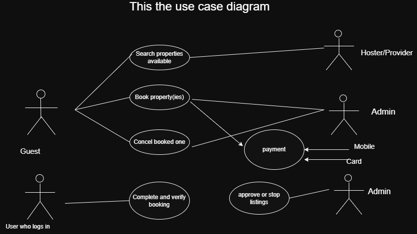

# Requirement Analysis in Software Development.
## Introduction
This repository explores the process of **Requirement Analysis** within the Software Development Life Cycle (SDLC).
The goal is to understand how to gather, prioritize, document, and validate software requirements to ensure successful project execution. the following are what you expet to find here.

Here, you'll see:
- Definitions and concepts
- Examples of functional and non-functional requirements
- Use case diagrams
- Templates and best practices
## What is Requirement Analysis?
 Requirement Analysis is a critical phase in the software development lifecycle (SDLC) where the project team gathers, analyzes, and defines the requirements of the software product to be developed. This process ensures that all stakeholders have a clear and mutual understanding of what the system should do and how it should perform.
## Why is Requirement Analysis Important?

- Clarity and Understanding: It helps in understanding what the stakeholders expect from the software, reducing ambiguity.  
- Scope Definition: Clearly defines the scope of the project, which helps in preventing scope creep.  
- Basis for Design and Development: Provides a solid foundation for designing and developing the system.
## Key Activities in Requirement Analysis

### 1. Requirement Gathering 
- **Interviews:** Conducting interviews with stakeholders to gather detailed information about their needs and expectations.
- **Surveys/Questionnaires:** Distributing surveys to collect requirements from a larger audience.
- **Workshops:** Organizing workshops with stakeholders to discuss and gather requirements.
- **Observation:** Observing end-users in their working environment to understand their needs.
- **Document Analysis:** Reviewing existing documentation and systems to understand current functionalities and requirements.

### 2. Requirement Elicitation 
- **Brainstorming:** Conducting brainstorming sessions to generate ideas and gather requirements.
- **Focus Groups:** Holding focus group discussions with selected stakeholders to gather detailed requirements.
- **Prototyping:** Creating prototypes to help stakeholders visualize the system and refine their requirements.

### 3. Requirement Documentation 
- **Requirement Specification Document:** Creating a detailed document that lists all functional and non-functional requirements.
- **User Stories:** Writing user stories to describe functionalities from the user’s perspective.
- **Use Cases:** Creating use case diagrams to show interactions between users and the system.

### 4. Requirement Analysis and Modeling 
- **Requirement Prioritization:** Prioritizing requirements based on their importance and impact on the project.
- **Feasibility Analysis:** Assessing the feasibility of requirements in terms of technical, financial, and time constraints.
- **Modeling:** Creating models (e.g., data flow diagrams, entity-relationship diagrams) to visualize and analyze requirements.

### 5. Requirement Validation 
- **Review and Approval:** Reviewing the documented requirements with stakeholders to ensure accuracy and completeness.
- **Acceptance Criteria:** Defining clear acceptance criteria for each requirement to ensure they meet the expected standards.
- **Traceability:** Establishing traceability matrices to ensure all requirements are addressed during development and testing.
## Types of Requirements.

### Functional Requirements
- Users (guests and hosts) can register, authenticate, and manage their profiles.
- Guests can search for properties by location, viewing photos, prices, ratings, and availability.
- Guests can make bookings and cancel them; once booked, rooms must reflect real-time availability.
- Hosts can add, update, or remove property listings, and monitor bookings.
- The system must process payments securely during bookings.

### Non-functional Requirements
- Search and booking responses should return with low latency to enable real-time responsiveness.
- The system should offer high availability, ensuring minimal downtime for users.
- Inventory must have strict consistency, preventing double-bookings via concurrency control.
- Architecture must scale to support hundreds of millions of users and hundreds of thousands of listings.
- All sensitive data (user info, payment details) must be encrypted and protected for security.
  
## Use Case Diagrams.

Use case diagrams illustrate how different types of users (actors) interact with the system to achieve specific goals (use cases). They help visualize the system's functionality from a user's perspective.

### Creating Use Case Diagrams

To build effective use case diagrams:

- **Identify Actors**: Examples include:
  - Guest (unauthenticated user)
  - Registered User (authenticated user)
  - Host
  - Admin
- **Define Use Cases**: Examples include:
  - Search properties
  - Book property
  - Cancel booking
  - Manage listings
  - Process payments
  - Approve or block listings
- **Draw Interactions**: Connect actors to the use cases they interact with using association lines.

### Benefits of Use Case Diagrams

- Provide a **clear visual representation** of the system’s functional scope.
- Help in **identifying and organizing system requirements** early in the design phase.
- Facilitate **communication among stakeholders**, developers, and designers by showing how users expect to interact with the system.

## Acceptance Criteria.

### importance of Acceptance Criteria

- ✅ Ensure all parties (developers, designers, stakeholders) have a **clear and shared understanding** of feature requirements.
- 🧪 Provide a **concrete basis for testing and validation**, helping teams know when a feature is complete.
- 🎯 Help maintain **high quality** and ensure the product meets **user expectations**.

  
## Example of Acceptance Criteria – Checkout Feature

### User Story
As a **registered user**,  
I want to complete my booking by making a secure payment,  
So that I can reserve my selected property.

### Acceptance Criteria
- ✅ User must be logged in to access the checkout page.
- ✅ The checkout page must display:
  - Property name
  - Booking dates
  - Price breakdown (base price, fees, total)
- ✅ User can apply a valid promo code and see the updated total.
- ✅ User must provide valid payment details (card number, expiry, CVV).
- ✅ The system must validate the payment before confirming the booking.
- ✅ On successful payment:
  - The booking is marked as **confirmed**
  - The property availability is updated
  - A confirmation message (email/SMS) is sent to the user
- ❌ On failed payment:
  - An appropriate error message is displayed
  - The booking is not confirmed or held
- ✅ The checkout process must complete within **5 seconds** under normal load.

This repo is part of a learning project under the ALX Software Engineering program especially Pro Dev Frontend .
